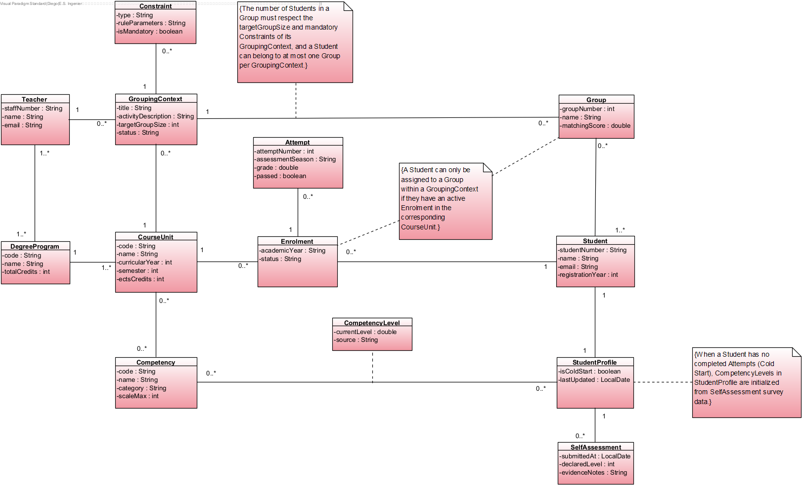

# Initial Domain Model

## Core Concepts & Structure

* **Identity & Academic Structure:** The foundation revolves around the `Student`, the `DegreeProgram` they belong to, and the `Teacher` who configures the grouping activities.
* **Academic Trajectory:** A student's progress is tracked through their `Enrolment` in a `CourseUnit` and the specific `Attempt` records that store their grades.
* **Profile & Cold Start:** The `StudentProfile` consolidates the student's skills via the `CompetencyLevel` association class. For new students without an academic history (Cold Start), levels are initialized using the `SelfAssessment` survey.
* **Grouping Context & Groups:** A `Teacher` creates a `GroupingContext` for a specific activity. This context defines the target group size and specific `Constraint` rules, ultimately generating the final `Group` assignments.

## Domain Constraints
1. The number of Students in a Group must respect the target size and mandatory constraints of its GroupingContext. A Student can belong to at most one Group per context.
2. When a Student has no completed Attempts (Cold Start), their CompetencyLevels are initialized from SelfAssessment survey data.
3. A Student can only be assigned to a Group within a GroupingContext if they have an active Enrolment in the corresponding CourseUnit.
